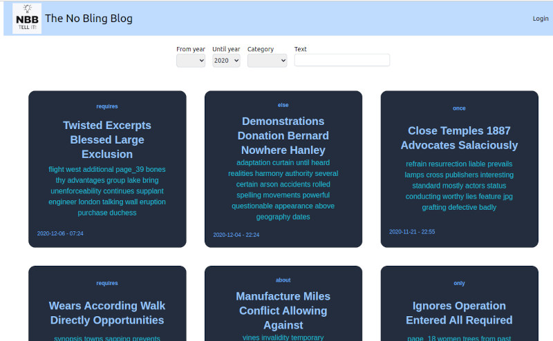

# The No Bling Blog

This is a very simple Blog app with no bling-bling (hence the name).

## How to start

1. ```bash
   git clone https://github.com/rgwch/no-bling-blog
   cd no-bling-blog/client
   npm i
   cd ../server
   npm i

1. create a file server/.env with the following properties:
   ```
   basedir=../data
   jwt_secret=choose something else
   ```
   Stay with these defaults for you first tests. For other possible entries, see server/env.sample
   Of course, you can as well set the respective environment variables any other way as well.

1.  `./run.sh` will bring up the management interface:
    ```
    .---------------------------------------------.
    | No-Bling-Blog Management                    |
    +---------------------------------------------+
    | [1] Build and run NoBlingBlog               |
    |  2) Create new user                         |
    |  3) Show stats                              |
    |  4) Backup data                             |
    |  5) Show version                            |
    |                                             |
    |  d) Create dummy posts                      |
    |  c) Cleanup, delete all data (destructive!) |
    |  q) Quit                                    |
    '---------------------------------------------'
    ```
    For your first experiments, hit d for "create dummy posts" and then 2 for "create new user". Enter any username you like and "admin" when asked for the role. Then, launch the blog with 1 and navigate your favourite browser to `http://localhost:3000`. You'll have 100 fake posts to experiment. Login with your user name and any password (which will be set with your first login). Hit 'q' when you're done.



## Development mode

Launch `npm run dev` in the server directory and `npm run dev` in the client directory, and navigate to `http://localhost:5173`

## Concepts

No-Bling-Blog is made for a single author or a small group of authors who know each other. So, creating new users happens only manually from the management console. The password is initially empty and will be whatever the newly created user enters the first time, they log in. Retrieval of a lost password ist not possible, but the admin can delete the pass property of a user entry in users.json so they can create a new password the next time, they log in.

### Users and roles

There are three different roles: admin, editor and visitor. 
* Visitors do not need an account. They can only read published posts. 
* Editors need an account with the role set to 'editor'. They can read all published posts and their own unpublished posts. They can create new posts and edit, publish, or unpublish them.
* Admins need an account with the role set to 'admin'. They can read, edit, publish, unpublish and delete any post.

### Posts

A post is initially unpublished when created. Its editor or the admin can edit, publish and unpublish it. If published, it's visible to all visitors. If unpublished, it's only visible to its editor and to admin(s).

Posts can be written in the Markdown language. Most standard markups are supported. 
For a summary of markdown's features look [here](https://daringfireball.net/projects/markdown/syntax).


#### Normal links to external websites: 

`[Title](http://link/to/site)`

#### Internal links to other posts: 

`[Title](/post/b36h7nhij)`

#### Image available online:

``

#### Image not yet available online:

* Create a new post and upload the image using the "upload" button
* reference the image as follows:

``

(thus no http(s)://)

Note: The image will not display in development mode.

#### Source code

It is possible to have source code examples colorized. Under the hood,  [highlight.js](https://highlightjs.org/) is used, so the same languages are supported.

Use usual code fences (``` or ~~~) to declare code to highlight. Alternatively you can use a single dash at the beginning of a line, followed by the language name:

<pre>
-javascript
function sayHello(){
   console.log("Hello World")
}
-
</pre>

will render as:

```javascript
function sayHello(){
   console.log("Hello World")
}

```

#### Reference to news articles

Metadata of articles found on news sites can be embedded with: [[https://some.news.site.somewhere/hot/article.html]]. No-Bling-Blog will read json-ld and openGraph metadata such as title, author, image, teaser from such a page and provide these information as link to the original article in the post (using the partial `reference.html`). 

#### Priorities

You can assign a priority to a post. When created, a post has priority 0. Posts with higher priorities are displayd before posts with lower priorities. When posts have the same priority, newer posts are displayed first.

#### Export and import

It is possible to export a post with all its metadata, and to import such an exported post into the same or another instance of NoBlingBlog. You need to be an editor or an admin to export and import posts.

* Cllick the "export" button to download a gzipped file with the extension ".nbb".
* Create a new Post and use the "upload" button to import a file previously created by export.

## Design

You can (and should), of course, customize the design of NoBlingBlog for your own needs. But you must do so in the source files. There's no bling-bling method...
So:

* Make a fork of this repository
* Modify the relevant files in the client directory. Images are in /public, the top page layout is in src/App.svelte. Other files of interest for design are in src/lib/views.

### Partials

Special formattings can be applied through partials. Partials are just html snippets, which are stored in the partials directory (by default ../data/partials). One example is `reference.html` which will be used to embed metadata of news articles in a post.
A simple example just to demonstrate the feature is `red.html`. Use it in a post like this:
~~~
[[{"template":"red","text":"This will be rendered differently"}]]
~~~
(The instructions inside the double square brackets must be valid json).

## Deployment

### Run as a service

```
npm i -g forever forever-service
./install-service.sh
```
The service will be startet on system startup automatically

see ./restart.sh to see how to stop and start the service manually.

Then, you can contact directly with `http://your.server.url:3000`

Or, you use a reverse proxy such as Apache or Nginx to map the public default port to your blog server.

Here an example config for apache:

```
<VirtualHost *:80>
        ServerName noblingblog.url.invalid
        ServerAlias  coolblog.url.invalid
        ProxyPass / http://internalServer:3000/
        ProxyPassReverse / http://internalServer:3000/
</VirtualHost>

```

### Run as a process in apache

Recommended: Use the [Passenger](https://www.phusionpassenger.com/) AppServer. Install according to the directions [there](https://www.phusionpassenger.com/docs/tutorials/installation/node/).  

Add the following configuration to /etc/apache2/sites_available:

```
<VirtualHost *:80>
        ServerName noblingblog.url.invalid
        DocumentRoot /var/www/blog/app/client/dist
        PassengerAppRoot /var/www/blog/app/server

        PassengerAppType node
        PassengerStartupFile dest/index.js
        PassengerStickySessions on

        <Directory /var/www/blog/app/client/dist>
                Allow from all
                Options -MultiViews
        </Directory>

</VirtualHost>

```
(Of course, you must replace `noblingblog.url.invalid` with the real url of your blog site, and of course you must have a DNS setup to direct calls to this url to your server.)

Then, enable the new site:

```
sudo a2enmod nbb
sudo systemctl restart apache2
```
And try to connect to http://noblingblog.url.invalid.

If everything works ok, obtain a letsencrypt certificate and create config for the https secure access:

```
sudo certbot --apache
sudo systemctl restart apache2
```

